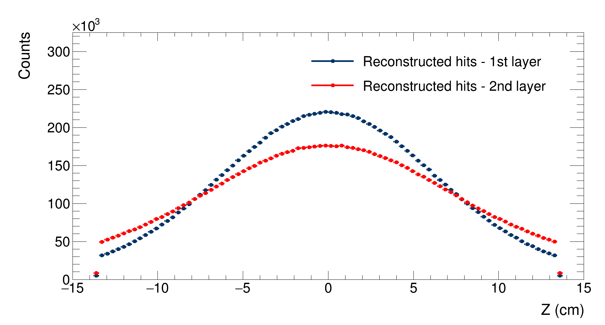

# Results

Optimisation has been one of the main aspects we have worked on while developing this project. We wanted to deliver a fast, yet accurate simulation. We think we managed to obtain good results, with a full simulation and reconstruction of 1 million events being run in under 1:30 minutes.

Following are the results of some simulations that we ran with different configurations. A comparison between them can be found at the end of the page

## Run 1
Configuration: 
- N events: 1 million
- Multiplicity distribution: [Charged-particle multiplicity measurement in proton-proton collisions at sqrt(s) = 7 TeV with ALICE at LHC](https://www.hepdata.net/record/54832)
- Angular distribution: Uniform
- $Z_{vertex}$ distribution: gaussian
- $\sigma_{x}=0.01$ cm, $\sigma_{y}=0.01$ cm, $\sigma_{z}=5.3$ cm
- Beam pipe radius: $3$ cm
- Detectors radii: $4$cm, $7$cm
- Noise: no

### Simulation

Firstly, this is a comparison between the multiplicity distribution probability and the (normalised) generated multiplicity distribution:

|| 
|:--:| 
|Comparison between the multiplicity distribution probability and the (normalised) generated multiplicity distribution| 

A good between the two distributions is observed.
In order to study the effects of the multiple scattering, it is possible to study the difference between the z coordinate distributions of the generated hit in the two layers and the distribution of the z coordinate of the vertex:

|| 
|:--:| 
|Distribution of the generated z coordinate of the vertex. $\mathrm{RMS}=5.3$ cm| 

|| 
|:--:| 
|Comparison between the distributions of the hits' z coordinate for the first layer (in blue, $\mathrm{RMS}=6.7$ cm) and the second layer (in red, $\mathrm{RMS}=7.7$ cm)| 

To study how the smearing affects the reconstruction, it is possible to study the distributions of the reconstructed z coordinates of the hits on each detector's layer:

|| 
|:--:| 
|Comparison between the distributions of the reconstructed (smeared) hits' z coordinate for the first layer (in blue, $\mathrm{RMS}=6.8$ cm) and the second layer (in red, $\mathrm{RMS}=7.4$ cm)| 
As expected, smearing does not have any effects on the shape of the distributions, nor does it affects the distributions widths as much as the multiple scattering does.

### Reconstruction
After the simulation finishes, vertexes are reconstructed and the resolution and effeciency of the detector are evaluated as a function of the event multiplicity and of the event's vertex Z coordinate.

|| 
|:--:| 
|Detector's resolution as a function of multiplicity|

As expected, the resolution decreases with the growing of the multiplicity, getting lower then 100 $\mu $m at the highest multiplicities.
An increase in resolution is observed at the highest multiplicity bin, but this is due to fluctuations in the simulation (the number of generated events at such multiplicity is very low, as described by the multiplicity distribution).

|| 
|:--:| 
|Detector's resolution as a function of the Z coordinate of the generated vertex|

As expected, the resolution reaches its minimum when the vertex is generated at the center of the detector, then it grows by 20% up to the point where the vertex is generated outside the detector. In these cases, the resolution grows exponentially and the efficiency drops as it is observed in this graph:

|| 
|:--:| 
|Detector's effuciency as a function of the Z coordinate of the generated vertex|

As expected, the efficieny peaks when the vertex is generated at the center of the detector; it then drops when the particles are generated outside the detector.

## Run 2
Configuration: 
- N events: 1 million
- Multiplicity distribution: uniform between 0 and 100
- Angular distribution: [http://personalpages.to.infn.it/~masera/tans/tans2018/miscellanea/kinem.root](http://personalpages.to.infn.it/~masera/tans/tans2018/miscellanea/kinem.root), histogram heta2
- $Z_{vertex}$ distribution: Uniform
- $\sigma_{x}=0.01$ cm, $\sigma_{y}=0.01$ cm, $\sigma_{z}=5.3$ cm
- Beam pipe radius: $3$ cm
- Detectors radii: $4$cm, $7$cm
- Mean noise: 10

### Simulation

Firstly, the simulated $\eta$ distribution is compared to the desired $\eta$ distribution:

|| 
|:--:| 
|Comparison between the (normalised) simulated $\eta$ distribution and the $\eta$ distribution probability function| 

A good between the two distributions is observed.

Major differeces between the $Z_{vertex}$ distributions and the $Z$ coordinates of the hits on the layers due to multiple scattering are not observed.

### Reconstruction
After the simulation finishes, vertexes are reconstructed and the resolution and effeciency of the detector are evaluated as a function of the event multiplicity and of the event's vertex Z coordinate.

|| 
|:--:| 
|Detector's resolution as a function of multiplicity|

As expected, the resolution decreases with the growing of the multiplicity, getting lower then 100 $\mu $m at the highest multiplicities.
An increase in resolution is observed at the highest multiplicity bin, but this is due to fluctuations in the simulation (the number of generated events at such multiplicity is very low, as described by the multiplicity distribution).

|| 
|:--:| 
|Detector's resolution as a function of the Z coordinate of the generated vertex|

As expected, the resolution reaches its minimum when the vertex is generated at the center of the detector, then it grows by 20% up to the point where the vertex is generated outside the detector. In these cases, the resolution grows exponentially and the efficiency drops as it is observed in this graph:

|| 
|:--:| 
|Detector's effuciency as a function of the Z coordinate of the generated vertex|

As expected, the efficieny peaks when the vertex is generated at the center of the detector; it then drops when the particles are generated outside the detector.