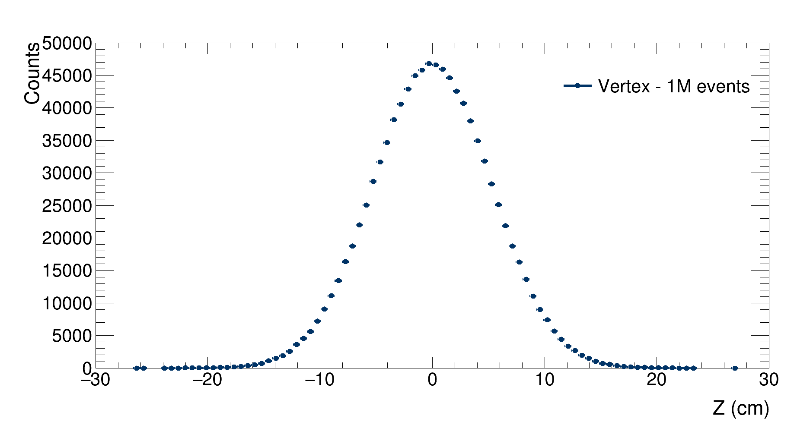
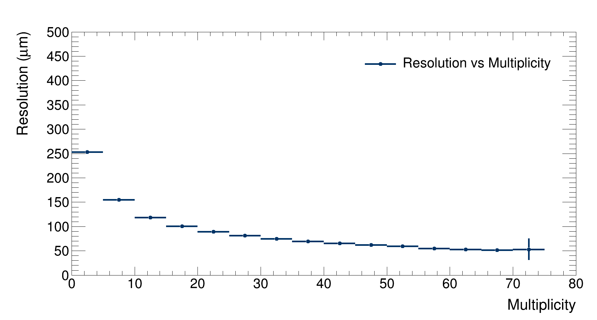
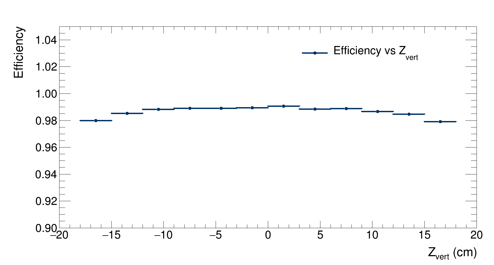
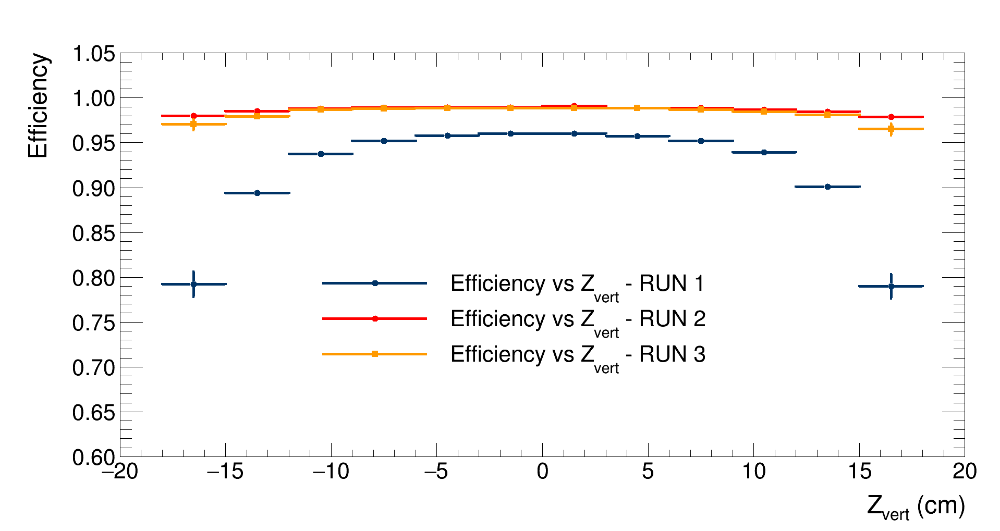

# Results

Optimisation has been one of the main aspects we have worked on while developing this project. We wanted to deliver a fast, yet accurate simulation. We think we managed to obtain good results, with a full simulation and reconstruction of 1 million events being run in under 2:30 minutes.

Following are the results of some simulations that we ran with different configurations. A comparison between them can be found at the end of the page

 Run1

 

## Run 1
Run1 simulation configuration [here](https://github.com/Bizzzio/TANS/tree/main/docs/Figures/Run1/Config_Run.yaml)

### Simulation

Firstly, this is a comparison between the multiplicity probability density function (pdf) and the (normalised) generated multiplicity distribution:

|| 
|:--:| 
|Comparison between the multiplicity pdf and the (normalised) generated multiplicity distribution| 

A good between the two distributions is observed.
In order to study the effects of the multiple scattering, it is possible to study the difference between the z coordinate distribution of the generated hit in the two layers and the z coordinate pdf of the vertex:

|| 
|:--:| 
|Distribution of the generated z coordinate of the vertex. $\mathrm{RMS}=5.3$ cm| 

|| 
|:--:| 
|Comparison between the distributions of the hits' z coordinate for the first layer (in blue, $\mathrm{RMS}=6.7$ cm) and the second layer (in red, $\mathrm{RMS}=7.7$ cm)| 

To study how the smearing affects the reconstruction, it is possible to study the distributions of the reconstructed z coordinates of the hits on each detector's layer:

|| 
|:--:| 
|Comparison between the distributions of the reconstructed (smeared) hits' z coordinate for the first layer (in blue, $\mathrm{RMS}=6.8$ cm) and the second layer (in red, $\mathrm{RMS}=7.4$ cm)| 

As expected, smearing does not have any effects on the shape of the distributions, nor does it affects the distributions widths as much as the multiple scattering does.

### Reconstruction
After the simulation finishes, vertexes are reconstructed and the resolution and effeciency of the detector are evaluated as a function of the event multiplicity and of the event's vertex Z coordinate. Run1 reconstruction configuration [here](https://github.com/Bizzzio/TANS/tree/main/docs/Figures/Run1/Config_Reconstruction.yaml)

|| 
|:--:| 
|Detector's resolution as a function of multiplicity|

As expected, the resolution decreases with the growing of the multiplicity, getting lower then 100 $\mu $m at the highest multiplicities.
An increase in resolution is observed at the highest multiplicity bin, but this is due to fluctuations in the simulation (the number of generated events at such multiplicity is very low, as described by the multiplicity pdf).

|| 
|:--:| 
|Detector's resolution as a function of the Z coordinate of the generated vertex|

As expected, the resolution reaches its minimum when the vertex is generated at the center of the detector, then it grows by 20% up to the point where the vertex is generated outside the detector. In these cases, the resolution grows exponentially and the efficiency drops as it is observed in this graph:

|| 
|:--:| 
|Detector's efficiency as a function of the Z coordinate of the generated vertex|

As expected, the efficiency peaks when the vertex is generated at the center of the detector; it then drops when the particles are generated outside the detector.

|| 
|:--:| 
|Detector's efficiency as a function of the event multiplicity|

 

Run2

  

## Run 2
Run2 simulation configuration [here](https://github.com/Bizzzio/TANS/tree/main/docs/Figures/Run2/Config_Run.yaml)
Configuration: 
- N events: 1 million
- Multiplicity distribution: uniform between 0 and 100
- Angular distribution: [http://personalpages.to.infn.it/~masera/tans/tans2018/miscellanea/kinem.root](http://personalpages.to.infn.it/~masera/tans/tans2018/miscellanea/kinem.root), heta2 histogram
- $Z_{vertex}$ distribution: uniform between $-20$ and $20$ cm from the detector's centre
- $\sigma_{x}=0.01$ cm, $\sigma_{y}=0.01$ cm, $\sigma_{z}=5.3$ cm
- Beam pipe radius: $3$ cm
- Detectors radii: $4$cm, $7$cm
- Mean noise per layer: 10

### Simulation

Firstly, the simulated $\eta$ distribution is compared to the desired $\eta$ distribution:

|| 
|:--:| 
|Comparison between the (normalised) simulated $\eta$ distribution and the $\eta$ distribution probability function| 

A good between the two distributions is observed.

Major differeces between the $Z_{vertex}$ distributions and the $Z$ coordinates of the hits on the layers due to multiple scattering are not observed.

### Reconstruction
After the simulation finishes, vertexes are reconstructed and the resolution and effeciency of the detector are evaluated as a function of the event multiplicity and of the event's vertex Z coordinate. Run2 reconstruction configuration [here](https://github.com/Bizzzio/TANS/tree/main/docs/Figures/Run2/Config_Reconstruction.yaml)

|| 
|:--:| 
|Detector's resolution as a function of multiplicity|

As expected, the resolution decreases with the growing of the multiplicity, getting lower then 100 $\mu $m at the highest multiplicities.
An increase in resolution is observed at the highest multiplicity bin, but this is due to fluctuations in the simulation (the number of generated events at such multiplicity is very low, as described by the multiplicity distribution).

|| 
|:--:| 
|Detector's resolution as a function of the Z coordinate of the generated vertex|

As expected, the resolution reaches its minimum when the vertex is generated at the center of the detector, then it grows by 20% up to the point where the vertex is generated outside the detector. In these cases, the resolution grows exponentially and the efficiency drops as it is observed in this graph:

|| 
|:--:| 
|Detector's efficiency as a function of the Z coordinate of the generated vertex|

As expected, the efficieny peaks when the vertex is generated at the center of the detector; it then drops when the particles are generated outside the detector.

|| 
|:--:| 
|Detector's efficiency as a function of the event multiplicity|

 

Run3

  

## Run 3
Run3 simulation configuration [here](https://github.com/Bizzzio/TANS/tree/main/docs/Figures/Run3/Config_Run.yaml)
Configuration: 
- N events: 1 million
- Multiplicity distribution: uniform between 0 and 100
- Angular distribution: [http://personalpages.to.infn.it/~masera/tans/tans2018/miscellanea/kinem.root](http://personalpages.to.infn.it/~masera/tans/tans2018/miscellanea/kinem.root), heta2 histogram
- $Z_{vertex}$ distribution: uniform between $-20$ and $20$ cm from the detector's centre
- $\sigma_{x}=0.01$ cm, $\sigma_{y}=0.01$ cm, $\sigma_{z}=5.3$ cm
- Beam pipe radius: $3$ cm
- Detectors radii: $4$cm, $7$cm
- Mean noise per layer: 10

### Simulation

Firstly, the simulated $\eta$ distribution is compared to the desired $\eta$ distribution:

|| 
|:--:| 
|Comparison between the (normalised) simulated $\eta$ distribution and the $\eta$ distribution probability function| 

A good between the two distributions is observed.

Major differeces between the $Z_{vertex}$ distributions and the $Z$ coordinates of the hits on the layers due to multiple scattering are not observed.

### Reconstruction
After the simulation finishes, vertexes are reconstructed and the resolution and effeciency of the detector are evaluated as a function of the event multiplicity and of the event's vertex Z coordinate. Run2 reconstruction configuration [here](https://github.com/Bizzzio/TANS/tree/main/docs/Figures/Run3/Config_Reconstruction.yaml)

|| 
|:--:| 
|Detector's resolution as a function of multiplicity|

As expected, the resolution decreases with the growing of the multiplicity, getting lower then 100 $\mu $m at the highest multiplicities. An increase in resolution is observed at the highest multiplicity bin, but this is due to fluctuations in the simulation (the number of generated events at such multiplicity is very low, as described by the multiplicity distribution).

|| 
|:--:| 
|Detector's resolution as a function of the Z coordinate of the generated vertex|

As expected, the resolution reaches its minimum when the vertex is generated at the center of the detector, then it grows by 20% up to the point where the vertex is generated outside the detector. In these cases, the resolution grows exponentially and the efficiency drops as it is observed in this graph:

|| 
|:--:| 
|Detector's efficiency as a function of the Z coordinate of the generated vertex|

As expected, the efficieny peaks when the vertex is generated at the center of the detector; it then drops when the particles are generated outside the detector.

|| 
|:--:| 
|Detector's efficiency as a function of the event multiplicity|

 

Comparisons

  

## Comparisons

|| 
|:--:| 
|Detector's efficiency as a function of the event multiplicity|
|| 
|:--:| 
|Detector's efficiency as a function of the event multiplicity|
|| 
|:--:| 
|Detector's efficiency as a function of the event multiplicity|
|| 
|:--:| 
|Detector's efficiency as a function of the event multiplicity|

 

Example

<ul><li>This dropdown contains</li>
<li>a list!</li></ul>

|| 
|:--:| 
|Detector's efficiency as a function of the event multiplicity|

Detector's efficiency as a function of the event multiplicity

