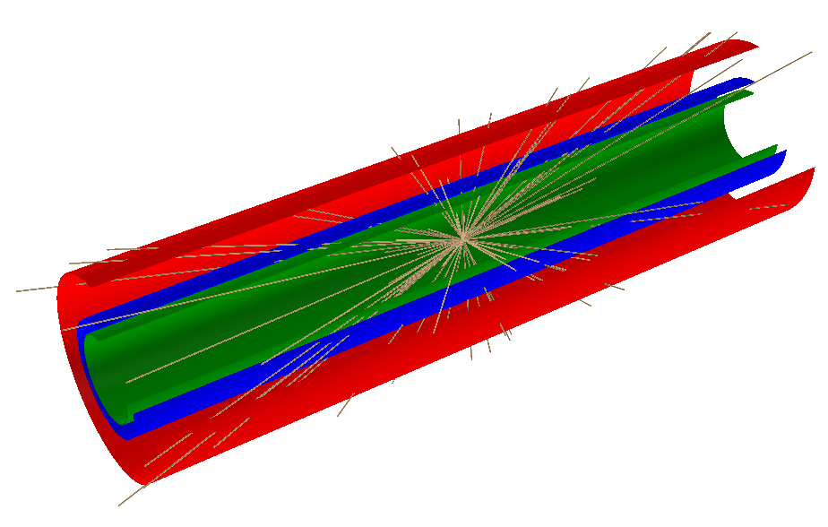

### Simulation

The code available in this repository runs a Monte Carlo (MC) simulation of a vertex detector, i.e. a detector that reconstructs the vertex position. The simulation consists of three parts:
- Firstly, the vertex is generated, together with all the particles produced in the collision
- The particles are then transported; they scatter through the beam pipe and the detector's layers and are detected by the detector
- Lastly, the hits on the detector are smeared and noise is simulated

#### Experimental setup description
In this simulation particles travelling along a $ z $ axis collide, pass through the beam pipe and are detected by $ 2 $ silicon layers. We have $ 3 $ cylindrical layers with $z$ axis corresponding to the trajectory of particles and radii $ r_1,\,r_2,\,r_3 $ with $ r_1<r_2<r_3 $. Geometric features and materials of the $3$ layers can be setted in the configuration file, here we discuss the case in which 
-   cylinder with $ r=r_1=3\, cm $ has a thickness $ t=0,8\,mm $. It is a beam pipe made of Berillium which does not interact with the material  
-   cylinder with $ r=r_2=4\, cm $ has a thickness $ t=0,2\,mm $. It is a silicon detector  which interacts with the material  
-   cylinder with $ r=r_2=7\, cm $ has a thickness $ t=0,2\,mm $. It is a silicon detector which interacts with the material  

|| 
|:--:| 
|Visualisation of generated event| 

### Running the simulation
To compile the simulation, it is sufficient to run ROOT and execute the following command:
```
.x Compile_Simulation.cpp+
```
To run the simulation execute the simulation function:
```
Simulation()
```

It is possible to add some arguments to the Compile_Simulation.cpp file to activate different options:
- `.x Compile_Simulation.cpp+("force")` to force the compilation of the different files
- `.x Compile_Simulation.cpp+("clean")` to delete all the compilation outputs coming from previous compilations before compiling
- `.x Compile_Simulation.cpp+("run")` to run the simulation after the compilation ends

It is possible to combine these options: for example, `.x Compile_Simulation.cpp+("cleanrun")` deletes all the compilation outputs coming from previous compilations, then runs the simulation after compilation

### Configuration of the simulation
It is possible to configure a simulation using a .yaml file, following these steps:

- Open the .yaml file in a text editor or configuration tool.
- Review the available parameters and their descriptions.
- Modify the values of the parameters as desired to configure the simulation.
- Save the .yaml file once you have finished making your changes.

The config file can then be passed to the simulation function: `Simulation("Config_file.yaml")`

[Here](https://github.com/Bizzzio/TANS/blob/main/Config_Run.yaml) CONTROLLARE LINK DOPO PULL REQUEST is an example of settings used to run a simulation.

A description of the settings is available [here](Settings.md).

### Program implementation
Here we give more details on how the program gets the work done for each run

- **Run construction:** Run class sets multiplicity, direction and angular distributions of particles according to the settings specified in the configuration file via handler classes. The family of detectors with custom features is created at run level and each of them has $ 2 $ vector-type data member where data will be collected. ROOT trees to save data are created and branch structure is defined. Then, Event class constructor is called to process single run events. 

- **Event processing:** Event class proceeds generating the particles in the event vertex, each of them with a specific direction. Then, scattering between particles and beam pipe and detectors is implemented according to the configuration options. For each interaction with detectors, coordinates of true hits and reconstructed hits are collected in the respective detector data members. If smearing effect is on, gaussian distributions with custom parameters modify true hits coordinates to give the reconstructed smeared point. If noise option is on, each detector collects noise hits generated from a poissonian distribution. Both in beam pipe and detector, if multiple scattering effect is on, $ \vartheta $ of particle momentum is modified by $ \vartheta^* = 1\, mrad $ while $ \varphi $ is randomized after scattering.

- **Data collection:** data saving is done at event-level by filling ROOT trees with event data collected in Run detectors vector-type data members. After saving data, vectors are cleared and ready to be filled by data related to the next event. Our goal is to save all particle-detector intersections: according to setup geometry, points on detectors can be described in cylindrical coordinates. The information about radii of detectors is saved at run level exploiting ROOT streamer. As a consequence, ROOT trees only need $ z $ coordinate of intersection and $ \varphi $ angle associated to the interacting particle for each point. The program uses $ 2 $ Trees, fTreeGen and fTreeRec. We take closer look at the Trees and Branches organisation and content:  

| Branch(Tree)          | Content                     |
| -----------           | -------                     |
| Config(fTreeGen)      | ciao:                       |
| TrueHits1(fTreeGen)   | ciao:                       |
| TrueHits2(fTreeGen)   | ciao:                       |
| RecHits1(fTreeRec)    | ciao:                       |
| RecHits2(fTreeRec)    | ciao:                       |
